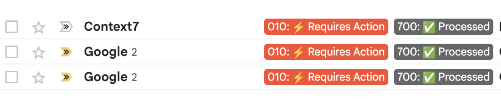
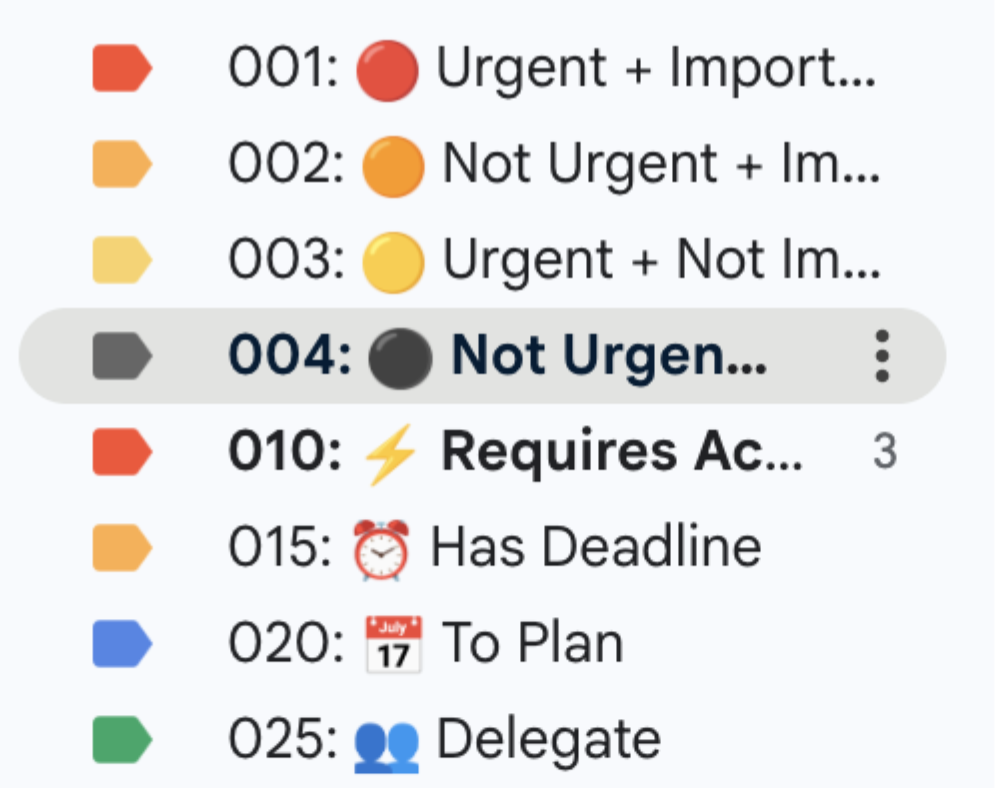

# Gmail Life Management System

[](https://opensource.org/licenses/MIT)
[](https://script.google.com/)
[](https://openai.com/)

An **open-source** intelligent Gmail automation system that uses ChatGPT to categorize emails by life areas and prioritize them using the Eisenhower Matrix. This system automatically sorts your emails into meaningful categories with hardcoded numbering prefixes for perfect Gmail organization.

## 📖 Table of Contents

- [Why This Open-Source Solution?](#-why-this-open-source-solution)
- [Features](#-features)
- [Real-Time Email Processing](#-real-time-email-processing)
- [Label System](#-label-system)
- [Quick Setup](#-quick-setup)
- [Installation](#-installation)
- [Function Reference](#-function-reference)
- [Troubleshooting](#-troubleshooting)
- [Contributing](#-contributing)
- [License](#-license)

## 💰 Why This Open-Source Solution?

### Cost Comparison with Commercial Platforms

| Platform | Monthly Cost | Annual Cost | Limitations |
|----------|-------------|-------------|-------------|
| **Zapier** | $20-50+ | $240-600+ | Limited free tier, complex workflows |
| **n8n Cloud** | $20-50+ | $240-600+ | Self-hosted complexity, maintenance |
| **Microsoft Power Automate** | $15-40+ | $180-480+ | Microsoft ecosystem lock-in |
| **This Solution** | **$5-15** | **$60-180** | **Unlimited, fully customizable** |

### 🎯 The Real Cost: Just ChatGPT API

- **GPT-4o-mini**: ~$0.002 per email analysis
- **Monthly cost**: $5-15 for typical usage (500-1000 emails)
- **No subscription fees, no vendor lock-in**
- **Complete control over your data and processing**

## 📊 Detailed API Costs & Limits

### 🤖 ChatGPT API (OpenAI)

**Cost**: $0.00015 per 1K input tokens, $0.0006 per 1K output tokens

- **GPT-4o-mini**: ~$0.002 per email analysis
- **Free tier**: $5 credit (expires after 3 months)
- **Rate limits**: 3,500 requests/minute
- **Monthly usage**: ~$5-15 for typical email volume

### 📧 Gmail API (Google)

**Cost**: **FREE** with generous limits

- **Daily quota**: 1 billion quota units
- **Per request cost**: 5 units (read), 100 units (write)
- **Free tier**: Unlimited for personal use
- **Rate limits**: 250 requests/second
- **No monthly charges** for normal usage

### 📊 Google Sheets API

**Cost**: **FREE** with generous limits

- **Daily quota**: 100 requests per 100 seconds per user
- **Free tier**: Unlimited for personal use
- **Rate limits**: 100 requests/100 seconds
- **No monthly charges** for normal usage

### 📅 Google Calendar API

**Cost**: **FREE** with generous limits

- **Daily quota**: 1 million requests
- **Free tier**: Unlimited for personal use
- **Rate limits**: 1,000 requests/second
- **No monthly charges** for normal usage

### 🔐 Google Apps Script

**Cost**: **COMPLETELY FREE**

- **Execution time**: 6 minutes per execution (free tier)
- **Triggers**: Unlimited time-based triggers
- **Storage**: 1GB for PropertiesService
- **No monthly charges** ever

### 💰 Total Monthly Cost Breakdown

| Service | Free Tier | Paid Cost | Your Usage |
|---------|-----------|-----------|------------|
| **Gmail API** | ✅ Unlimited | $0 | $0 |
| **Sheets API** | ✅ Unlimited | $0 | $0 |
| **Calendar API** | ✅ Unlimited | $0 | $0 |
| **Apps Script** | ✅ Unlimited | $0 | $0 |
| **ChatGPT API** | $5 credit | ~$5-15/month | **Only cost** |

**Total Monthly Cost: $5-15** (only ChatGPT API)

### 📈 Cost Scaling Examples

| Emails/Day | ChatGPT Cost/Month | Total Cost/Month |
|------------|-------------------|------------------|
| 10 emails | $2 | $2 |
| 50 emails | $8 | $8 |
| 100 emails | $15 | $15 |
| 500 emails | $75 | $75 |

### 🆓 Free Tier Benefits

- **Google APIs**: Completely free for personal use
- **Apps Script**: No execution limits for normal usage
- **Gmail**: Unlimited email processing
- **Sheets**: Unlimited report generation
- **Calendar**: Unlimited reminder creation

### 💡 Cost Optimization Tips

1. **Use GPT-4o-mini**: Cheapest model with excellent results
2. **Batch processing**: Process multiple emails in one API call
3. **Smart filtering**: Skip obvious spam without AI analysis
4. **Caching**: Store analysis results to avoid re-processing
5. **Free tier**: Start with $5 OpenAI credit (3 months free)

### Why Commercial Platforms Are Expensive

1. **Subscription Model**: Pay monthly regardless of usage
2. **Limited Free Tiers**: Quickly hit limits on free plans
3. **Vendor Lock-in**: Difficult to migrate or customize
4. **Complex Pricing**: Multiple tiers with hidden costs
5. **Data Privacy**: Your data processed on third-party servers

## 🚀 Features

### Core Functionality

- **AI-Powered Email Analysis**: Uses ChatGPT to understand email content and context
- **Life Area Categorization**: Automatically categorizes emails into 40+ life areas (Health, Work, Family, Finance, etc.)
- **Eisenhower Matrix Priority System**: Assigns priority levels based on urgency and importance
- **Hardcoded Label Numbering**: Uses deterministic numbering (001:, 010:, 020:, etc.) for perfect Gmail sorting
- **Automatic Labeling**: Creates and applies Gmail labels for easy organization
- **Spam Detection**: Automatically identifies and handles spam/junk emails
- **Inbox Zero**: Automatically archives processed emails
- **Smart Reminders**: Creates calendar events for urgent tasks with 30-minute buffer time
- **Analytics & Reporting**: Generates processing reports and statistics


*Gmail interface showing processed emails with "010: Requires Action" and "700: Processed" labels applied automatically*

### Open-Source Advantages

- **🔓 Completely Free**: No licensing fees or subscriptions
- **🛠️ Fully Customizable**: Modify code to fit your exact needs
- **🔒 Privacy First**: Your data stays in your Google account
- **📈 Scalable**: Process unlimited emails without per-email costs
- **🌍 Community Driven**: Open source, community contributions welcome

## ⚡ Real-Time Email Processing

### Two Processing Modes

The system supports two processing modes that can be configured via environment variables:

#### **1. Real-Time Mode (Recommended)**

- **Processes emails as they arrive** - no waiting
- **Runs every 10 minutes** to catch new emails quickly
- **Processes only unread emails** for efficiency
- **Perfect for active email users** who want immediate processing

#### **2. Scheduled Mode (Legacy)**

- **Processes emails every 30 minutes** in batches
- **Processes all inbox emails** each time
- **Lower resource usage** - good for light email users
- **Traditional batch processing** approach

### Configuration

```javascript
// Set processing mode via environment variables
setProcessingMode('realtime');     // or 'scheduled'
setRealtimeEnabled(true);          // or false

// Quick mode switching
enableRealtimeMode();              // Switch to real-time
enableScheduledMode();             // Switch to scheduled

// Check current mode
getCurrentProcessingMode();        // Shows current configuration
```

### Environment Variables

The system reads configuration from environment variables (stored securely in PropertiesService):

- `PROCESSING_MODE`: `'realtime'` or `'scheduled'`
- `REALTIME_ENABLED`: `'true'` or `'false'`
- `OPENAI_API_KEY`: Your OpenAI API key
- `SPREADSHEET_ID`: Google Sheets ID for reports (optional)

### Benefits of Real-Time Mode

1. **Immediate Processing**: Emails are categorized as soon as they arrive
2. **Better User Experience**: No waiting for the next scheduled run
3. **Efficient Resource Usage**: Only processes new unread emails
4. **Responsive System**: Quick turnaround for urgent emails
5. **Modern Approach**: Mimics real-time email clients

## 🏷️ Label System

### Hardcoded Numbering System

The system uses **hardcoded number prefixes** for deterministic Gmail sorting:

#### **Eisenhower Matrix (001-004)**

- `001: 🔴 Urgent + Important`
- `002: 🟠 Not Urgent + Important`
- `003: 🟡 Urgent + Not Important`
- `004: ⚫ Not Urgent + Not Important`

#### **Action Labels (010-025) - 5 distance**

- `010: ⚡ Requires Action`
- `015: ⏰ Has Deadline`
- `020: 📅 To Plan`
- `025: 👥 Delegate`

#### **Critical Life (030-045) - 5 distance**

- `030: 🚨 Emergency`
- `035: 🏥 Health`
- `040: ⚕️ Medical`
- `045: ⚖️ Legal`

#### **Financial (050-070) - 5 distance**

- `050: 💰 Bills`
- `055: 🏦 Banking`
- `060: 📑 Taxes`
- `065: 🛡️ Insurance`
- `070: 💳 Debt`

#### **Work & Family (080+) - 10+ distance**

- Work: `080`, `090`, `100`, `110`, `120`, `130`
- Family: `150`, `160`, `170`, `180`
- Home: `200`, `210`, `220`, `230`
- And many more categories...

### Benefits of Hardcoded System

1. **🎯 Deterministic**: Labels always sort in the same order
2. **🔧 Easy Insertion**: Plenty of space between numbers for new labels
3. **📋 Perfect Spacing**: 5 distance for critical categories, 10+ for others
4. **🚫 No Conflicts**: Each label has a unique, well-spaced number
5. **🔮 Future-Proof**: Massive space for new labels and categories


*Eisenhower Matrix labels (001-004) and action labels (010-025) with proper numbering and color coding for perfect Gmail sorting*

### Adding New Labels

To add new labels, simply edit `CONFIG.LABELS` and add:

```javascript
NEW_LABEL_KEY: {
  name: "XXX: 🏷️ Your Label Name",
  color: "blue"
}
```

Labels are automatically sorted by Gmail based on their hardcoded number prefixes!

## 🚀 Quick Setup

### 1. Basic Setup

```javascript
// Set your OpenAI API key
setSecret("OPENAI_API_KEY", "your-api-key-here");

// Run complete setup
completeSetup();
```

### 2. Choose Processing Mode

```javascript
// For real-time processing (recommended)
enableRealtimeMode();

// OR for scheduled processing (legacy)
enableScheduledMode();
```

### 3. Verify Configuration

```javascript
// Check current mode
getCurrentProcessingMode();

// Check date filtering status
showDateFilteringStatus();

// Update all label colors
updateLabelColors();
```

### 4. Date Filtering (Important!)

**By default, the script only processes emails from today forward** to prevent expensive processing of thousands of historical emails.

```javascript
// Check current date filtering
showDateFilteringStatus();

// To process historical emails (use with caution!)
setProcessHistoricalEmails(true);

// To set a custom start date
setProcessingDate("2024-01-01");

// To disable historical processing
setProcessHistoricalEmails(false);
```

That's it! Your Gmail will now be automatically organized.

## 📦 Installation

### Prerequisites

- Google Account with Gmail
- OpenAI API account and key
- Google Sheets (optional, for reports)

### Step-by-Step Installation

1. **Open Google Apps Script**
   - Go to [script.google.com](https://script.google.com)
   - Click "New Project"
   - Name it "Gmail Life Management"

2. **Copy the Code**
   - Delete the default `Code.gs` content
   - Copy and paste the entire `main.gs` file

3. **Enable Required APIs**
   - Click "Services" (➕ icon)
   - Add: Gmail API, Google Sheets API, Calendar API

4. **Set Up Secrets**

   ```javascript
   // Run these commands in the Apps Script editor
   setSecret("OPENAI_API_KEY", "sk-your-openai-api-key-here");
   setSecret("SPREADSHEET_ID", "your-spreadsheet-id-here"); // Optional
   ```

5. **Complete Setup**

   ```javascript
   completeSetup(); // This does everything automatically
   ```

6. **Authorize Permissions**
   - The script will ask for Gmail, Calendar, and Sheets permissions
   - Review and approve all permissions

## 📚 Function Reference

## 🚀 **START HERE: Main Setup Function**

### `setup()` - **THE MAIN FUNCTION YOU NEED**

**🎯 Purpose**: Complete system setup and configuration - **SAFE TO RUN MULTIPLE TIMES**  
**📋 Usage**: `setup()`  
**⚡ What it does**:

1. **📅 Initializes processing date** (prevents processing old emails)
2. **🧹 Cleans up incorrect labels** (removes any labels that don't match our system)
3. **🏷️ Creates all labels** with proper hardcoded numbering (001:, 010:, 020:, etc.)
4. **🎨 Updates label colors** (if Gmail API is available)
5. **⚙️ Sets up automatic triggers** for email processing
6. **✅ Validates the entire system**

**🔄 Safe to Re-run**: This function is designed to be **completely safe** to run multiple times. It will:
- ✅ Skip already created labels
- ✅ Update existing labels if needed
- ✅ Clean up any inconsistencies
- ✅ Reset triggers properly
- ✅ Never delete your emails or data

**🎯 When to use**:
- **First time setup**: Run `setup()` to get everything configured
- **After configuration changes**: Run `setup()` to apply new settings
- **Troubleshooting**: Run `setup()` to fix any label or trigger issues
- **System maintenance**: Run `setup()` periodically to ensure everything is working

**📝 Example**:
```javascript
// Run this to set up your entire system
setup();
```

**🔧 Alternative: `completeSetup()`** - For comprehensive setup with testing:
- Includes `setup()` + system validation + testing
- Use this for first-time installation
- More thorough but takes longer

```javascript
// For complete first-time setup with testing
completeSetup();
```

---

### Main Processing Functions

#### `processLifeEmails()`

**Purpose**: Main scheduled processing function  
**Usage**: Automatically triggered every 30 minutes in scheduled mode  
**What it does**:

- Validates system configuration
- Gets up to 50 inbox emails
- Processes each unstarred email
- Generates processing reports

#### `processNewEmails()`

**Purpose**: Real-time processing function  
**Usage**: Automatically triggered every 10 minutes in real-time mode  
**What it does**:

- Processes only unread emails
- Handles up to 5 emails per batch
- More efficient for active users

### System Setup Functions

#### `completeSetup()`

**Purpose**: One-command complete system setup  
**Usage**: `completeSetup()`  
**What it does**:

1. Validates secrets configuration
2. Creates all Gmail labels with proper numbering
3. Sets up automatic triggers
4. Tests the system
5. Shows current processing mode

#### `setup()`

**Purpose**: Main setup function for the entire system  
**Usage**: `setup()`  
**What it does**:

- Cleans up incorrect labels
- Creates all proper labels with hardcoded prefixes
- Updates label colors (if Gmail API available)
- Sets up automatic triggers
- Configures processing mode

#### `setupAutoTriggers()`

**Purpose**: Configures automatic processing triggers  
**Usage**: `setupAutoTriggers()`  
**What it does**:

- Removes old triggers
- Sets up processing triggers based on mode
- Configures daily report generation

#### `setupSecrets()`

**Purpose**: Validates required secrets  
**Usage**: `setupSecrets()`  
**What it does**:

- Checks OpenAI API key
- Validates API connectivity
- Verifies Sheets access (if configured)

### Email Analysis Functions

#### `analyzeEmailWithChatGPT(emailData)`

**Purpose**: Analyzes email content with AI  
**Parameters**: `emailData` - Object with subject, sender, body  
**Returns**: Analysis object with categories, priority, actions  
**What it does**:

- Sends email to ChatGPT for analysis
- Determines life categories (can be multiple)
- Assigns Eisenhower Matrix priority
- Identifies spam/junk
- Suggests actions and deadlines

#### `processEmailThread(thread)`

**Purpose**: Processes a single email thread  
**Parameters**: `thread` - Gmail thread object  
**What it does**:

- Extracts email data
- Analyzes with ChatGPT
- Applies appropriate labels
- Takes priority-based actions
- Logs processing results

#### `applyLifeManagementLabels(thread, analysis)`

**Purpose**: Applies category labels to email  
**Parameters**: `thread` - Gmail thread, `analysis` - ChatGPT analysis result  
**What it does**:

- Creates labels if they don't exist
- Applies multiple category labels
- Handles spam/junk detection
- Marks low-confidence emails for review

#### `applyPriorityActions(thread, analysis, quadrant)`

**Purpose**: Takes actions based on Eisenhower priority  
**Parameters**: `thread` - Gmail thread, `analysis` - Analysis result, `quadrant` - Eisenhower quadrant (1-4)  
**What it does**:

- Quadrant 1: Mark important, create calendar reminder
- Quadrant 2: Mark important, add planning label
- Quadrant 3: Add delegation label
- Quadrant 4: Archive or mark as low priority

### Label Management Functions

#### `getLabelName(labelKey)`

**Purpose**: Gets hardcoded label name from key  
**Parameters**: `labelKey` - Label key like 'HEALTH', 'URGENT_IMPORTANT'  
**Returns**: Hardcoded label name like "030: 🏥 Health"  
**What it does**:

- Returns the hardcoded name with number prefix
- Ensures consistent label naming
- Enables automatic Gmail sorting

#### `getOrCreateLabel(labelKey)`

**Purpose**: Gets existing label or creates new one  
**Parameters**: `labelKey` - Label key or name  
**Returns**: Gmail label object  
**What it does**:

- Handles different label formats
- Creates missing labels with proper numbering
- Returns Gmail label object for use

#### `findLabelKeyByName(name)`

**Purpose**: Finds label key from label name  
**Parameters**: `name` - Label name (with or without number prefix)  
**Returns**: Label key string  
**What it does**:

- Searches through all label configurations
- Handles both numbered and plain names
- Returns corresponding key for further processing

### Cleanup and Migration Functions

#### `cleanupIncorrectLabels()`

**Purpose**: Removes ALL labels that don't match agreements  
**Usage**: `cleanupIncorrectLabels()`  
**What it removes**:

- Constant key labels (e.g., "HEALTH")
- Old numbered labels (e.g., "001: Old Label")
- Unknown/custom labels not in CONFIG
- Preserves Gmail system labels  
**What it does**:

1. Identifies all non-compliant labels
2. Removes labels from all emails first
3. Deletes the labels
4. Recreates proper labels via `setup()`

#### `listIncorrectLabels()`

**Purpose**: Shows labels that don't match agreements (safe inspection)  
**Usage**: `listIncorrectLabels()`  
**Returns**: Array of incorrect label objects  
**What it shows**:

- Current label name
- What it should be
- Number of emails affected
- Label type (constant_key, old_numbered, unknown)

#### `fixAndRecreateAllLabels()`

**Purpose**: Recreates all labels with hardcoded prefixes  
**Usage**: `fixAndRecreateAllLabels()`  
**What it does**:

1. Cleans up incorrect labels first
2. Creates Eisenhower Matrix labels with hardcoded prefixes
3. Creates all life category labels with hardcoded prefixes
4. Ensures deterministic label naming
5. No data loss - all emails preserved

#### `showOurLabelAgreements()`

**Purpose**: Shows all labels that should exist according to our system  
**Usage**: `showOurLabelAgreements()`  
**What it displays**:

- Eisenhower Matrix labels
- Categorized life area labels
- Priority information

#### `updateLabelColors()`

**Purpose**: Updates colors for all labels according to configuration  
**Usage**: `updateLabelColors()`  
**What it does**:

- Updates Eisenhower Matrix label colors
- Updates all other label colors
- Provides summary of successful/failed updates

#### `updateSingleLabelColor(labelName, colorName)`

**Purpose**: Updates color for a specific label  
**Usage**: `updateSingleLabelColor("001: 🔴 Urgent + Important", "red")`  
**Parameters**:

- `labelName`: Full label name as it appears in Gmail
- `colorName`: Color name (red, orange, yellow, green, blue, purple, pink, gray, black, white)

#### `showGmailAPISetupInstructions()`

**Purpose**: Shows detailed instructions for enabling Gmail API  
**Usage**: `showGmailAPISetupInstructions()`  
**What it displays**:

- Step-by-step Gmail API setup
- Manual color setup instructions
- Recommended color scheme

#### `checkGmailAPIStatus()`

**Purpose**: Checks if Gmail API is enabled and working  
**Usage**: `checkGmailAPIStatus()`  
**Returns**: `true` if API is available, `false` if not

#### `showManualColorSetup()`

**Purpose**: Shows detailed manual color setup instructions  
**Usage**: `showManualColorSetup()`  
**What it displays**:

- Step-by-step manual color setup
- Complete list of all labels with recommended colors
- Gmail settings navigation instructions

#### `showGmailAllowedColors()`

**Purpose**: Shows all Gmail API compatible colors  
**Usage**: `showGmailAllowedColors()`  
**What it displays**:

- Complete list of Gmail API allowed colors
- Hex codes and text color recommendations
- Light and dark color variations

#### `testSingleLabelColor()`

**Purpose**: Tests color update on a single label to avoid systematic errors  
**Usage**: `testSingleLabelColor()`  
**What it does**:

- Tests color update on just one label
- Prevents systematic error repetition
- Shows if Gmail API is working correctly
- Safe way to test before running full color update

#### `applyLabelWithTrashLogic(thread, labelKey)`

**Purpose**: Applies label and handles trash logic  
**Usage**: `applyLabelWithTrashLogic(thread, 'SPAM')`  
**What it does**:

- Applies label to thread
- Moves to trash if moveToTrash is true
- Handles errors gracefully

### Quick Access Functions

```javascript
// Quick mode switching
switchToRealtime();    // Alias for enableRealtimeMode()
switchToScheduled();   // Alias for enableScheduledMode()

// Label management shortcuts
```

## 🚨 Troubleshooting

### Common Issues

#### "Script timeout" Error

**Cause**: Processing too many emails at once  
**Solution**:

```javascript
// Reduce batch size in CONFIG
BATCH_SIZE: 5,        // Reduce from 10
MAX_EMAILS_PER_RUN: 25, // Reduce from 50
```

#### "Gmail API has not been used" Error

**Cause**: Gmail API not enabled for your project  
**Solution**:

1. Run `showGmailAPISetupInstructions()` for detailed setup
2. Or set colors manually in Gmail Settings > Labels
3. Run `checkGmailAPIStatus()` to verify API availability

#### "Label color is not on the allowed color palette" Error

**Cause**: Using colors not allowed by Gmail API  
**Solution**:

1. Run `showGmailAllowedColors()` to see compatible colors
2. Update color names in CONFIG to use allowed colors only
3. Use colors like: red, orange, yellow, green, blue, purple, pink, gray, black, white

#### "Systematic Error" - Script Stops After First Error

**Cause**: Error that will repeat for all labels (e.g., API not enabled, wrong colors)  
**Solution**:

1. Run `testSingleLabelColor()` to test one label safely
2. Fix the error shown in the test
3. Run `updateLabelColors()` again after fixing the error
4. Script will stop on first error to prevent repetition

#### "OpenAI API Error"

**Cause**: Invalid API key or quota exceeded  
**Solution**:

```javascript
// Verify API key
validateSystem();

// Check current model
console.log(CONFIG.GPT_MODEL);

// Switch to cheaper model
CONFIG.GPT_MODEL = 'gpt-4o-mini';
```

#### "Labels not sorting correctly"

**Cause**: Old labels still exist or incorrect numbering  
**Solution**:

```javascript
// Check for incorrect labels
listIncorrectLabels();

// Clean up everything
cleanupIncorrectLabels();

// Recreate all labels with hardcoded prefixes
fixAndRecreateAllLabels();
```

#### "Permission denied" Errors

**Cause**: Missing API permissions  
**Solution**:

1. Go to Google Apps Script project
2. Click "Services" (➕)
3. Add: Gmail API, Google Sheets API, Calendar API
4. Re-run authorization

#### "Trigger not working"

**Cause**: Triggers not set up or expired  
**Solution**:

```javascript
// Reset triggers
setupAutoTriggers();

// Check current mode
getCurrentProcessingMode();

// Manual trigger setup
ScriptApp.newTrigger('processNewEmails')
  .timeBased()
  .everyMinutes(10)
  .create();
```

### Debug Mode

Enable detailed logging:

```javascript
// Add to your functions
console.log('Debug: Processing email', emailData.subject);
console.log('Debug: Analysis result', analysis);
```

### Performance Issues

If processing is slow:

1. **Reduce batch size**
2. **Use cheaper GPT model**
3. **Enable real-time mode** (processes fewer emails per run)
4. **Check API quotas**

### Getting Help

1. **Check logs**: Apps Script > Executions
2. **Validate system**: Run `validateSystem()`
4. **Review configuration**: Run `showOurLabelAgreements()`
5. **Check label status**: Run `showOurLabelAgreements()`

## 🤝 Contributing

We welcome contributions! Here's how you can help:

### Development Setup

1. **Fork the repository**
2. **Create feature branch**: `git checkout -b feature/amazing-feature`
3. **Make changes** and test thoroughly
4. **Run all test functions**:

```javascript
validateSystem();
showOurLabelAgreements();
```

5. **Submit pull request**

### Contribution Guidelines

- **Code Style**: Follow existing patterns
- **Documentation**: Update README for new functions
- **Testing**: Add test cases for new features
- **Backwards Compatibility**: Don't break existing setups

### Areas for Contribution

- **New Label Categories**: Add more life areas
- **Better AI Prompts**: Improve email analysis
- **Additional Actions**: More Eisenhower Matrix actions
- **UI Improvements**: Better setup and configuration
- **Performance**: Optimization and efficiency
- **Integrations**: Connect with other services

### Reporting Issues

Please include:

- **Script version/commit**
- **Error messages** (full stack trace)
- **Steps to reproduce**
- **Expected vs actual behavior**
- **Your configuration** (without API keys)

## 📄 License

This project is licensed under the MIT License.

### What this means

- ✅ **Commercial use allowed**
- ✅ **Modification allowed**
- ✅ **Distribution allowed**
- ✅ **Private use allowed**
- ❗ **No warranty provided**
- ❗ **License and copyright notice required**

---

*Made with ❤️ by the open-source community. Star ⭐ this project if it helps you achieve inbox zero!*
